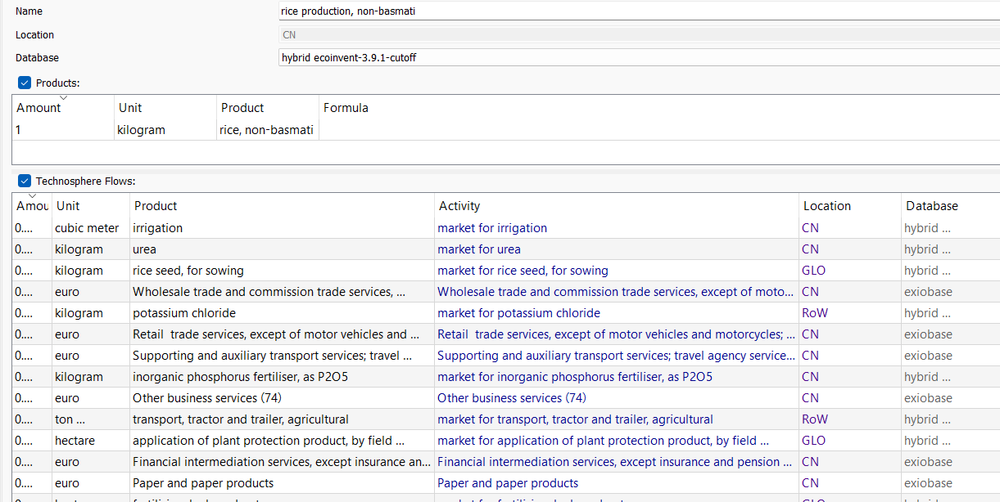
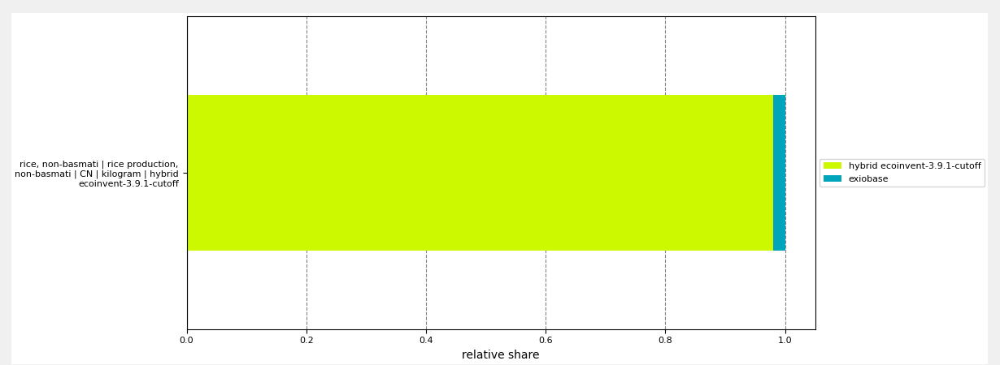

# pyLCAIO
```pyLCAIO```  is a Python package to automatically hybridize the ecoinvent database with the exiobase database. In other
words, ecoinvent processes will be added inputs which are deemed missing from the process description. Typical such inputs
are services, such as business trips, banking, insurance, advertisement, IT, etc. Hybridizing allows to complete the scope
of the data to englobe the whole economy instead of being confined to the sectors covered by ecoinvent.

For instance, here we show the process of production of rice in China from ecoinvent. After hybridization with 
pyLCAIO, the process is added wholesale and retail services, support transport services, etc. based on the average usage
of such services by the corresponding sector of activity in exiobase (i.e., for rice -> Paddy rice))



Then, in the LCI calculations, the impact of those added inputs is accounted for to obtain a more complete impact assessment.
Here in the example shown, those added inputs only account for a ~2% additional increase but the average increase is
around 9% for the GWP100 indicator.



As of the v3, pyLCAIO is only usable through the brightway2 LCA software.

## Methodology
For a deep dive in the methodology, check the methodology.md file.

## Related publications
* Majeau-Bettez, G., Agez, M., Wood, R., Södersten, C., Margni, M., Strømman, A. H., & Samson, R. (2017). Streamlined Hybridization software: merging Ecoinvent and Exiobase. In Biennial Conference of the International Society for Industrial Ecology.
* Agez, M., Majeau-Bettez, G., Margni, M., Strømman, A. H., & Samson, R. (2019). Lifting the veil on the correction of double counting incidents in hybrid Life Cycle Assessment. Journal of Industrial Ecology, 24(3), 517–533. https://doi.org/https://doi.org/10.1111/jiec.12945
* Agez, M., Wood, R., Margni, M., Strømman, A. H., Samson, R., & Majeau-Bettez, G. (2020). Hybridization of complete LCA and MRIO databases for a comprehensive product system coverage. Journal of Industrial Ecology, 24(4), 774–790. https://doi.org/10.1111/jiec.12979
* Agez, M., Muller, E., Patouillard, L., Södersten, C. J. H., Arvesen, A., Margni, M., Samson, R., & Majeau-Bettez, G. (2021). Correcting remaining truncations in hybrid LCA database compilation. Journal of Industrial Ecology. https://doi.org/10.1111/jiec.13132
* Jakobs, A., Schulte, S., Pauliuk, S. (2021) Price Variance in Hybrid-LCA Leads to Significant Uncertainty in Carbon Footprints. Front. Sustain. https://doi.org/10.3389/frsus.2021.666209

## Contact
maxime.agez@polymtl.ca